# 🚀 Production-Ready Two-Tier Web Application on AWS

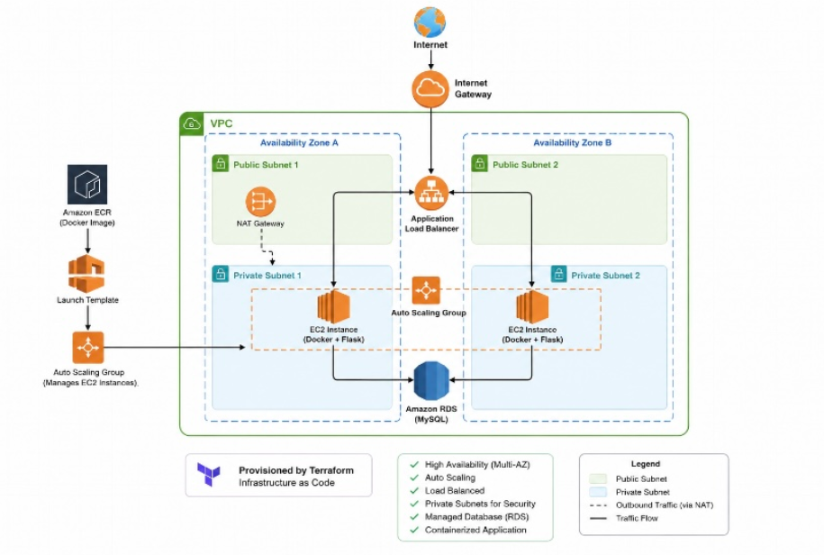

## 📌 Project Overview

Many startups and small businesses begin by hosting applications on a single server. This creates several problems:

- Application downtime when the server fails
- Manual deployments
- Limited scalability
- Poor infrastructure visibility
- Security challenges

This project solves these challenges by designing and deploying a **highly available, scalable, and secure two-tier web application architecture on AWS**.

The application is built using modern Cloud Engineering and DevOps practices including:

- Infrastructure as Code
- Containerization
- Load Balancing
- Auto Scaling
- Secure Networking
- Managed Database Services
- IAM Security
- Automated Infrastructure Provisioning


---

# 🎯 Project Objectives

The goal of this project was to design a production-style cloud environment where:

✅ Application servers can scale automatically  
✅ Traffic is distributed across multiple instances  
✅ Infrastructure can be recreated using Terraform  
✅ Application deployment is containerized using Docker  
✅ Database resources are isolated securely  
✅ AWS security best practices are followed  


---

# 🏗️ Architecture Overview

The solution implements a two-tier architecture:

```
                    Users
                      |
                      |
                      ↓

          Application Load Balancer
                      |
                      |
                      ↓

          Auto Scaling Group
                      |
        -------------------------
        |                       |
        ↓                       ↓

    EC2 Instance          EC2 Instance
    Docker Container      Docker Container


                      |
                      ↓

              Amazon RDS MySQL


Terraform provisions the AWS infrastructure

GitHub
   |
   ↓
Docker Image
   |
   ↓
Amazon ECR
   |
   ↓
EC2 Deployment
```

---

# ☁️ AWS Services Used

## Networking

### Amazon VPC

Created a custom Virtual Private Cloud containing:

- Public subnets
- Private subnets
- Internet Gateway
- NAT Gateway
- Route Tables


## Compute

### Amazon EC2

Used EC2 instances to run Dockerized application containers.

Features:

- Amazon Linux 2023
- Private subnet deployment
- IAM instance profile
- Automated Docker installation


## Load Balancing

### Application Load Balancer

Provides:

- Traffic distribution
- High availability
- Health checks
- Fault tolerance


## Auto Scaling

### Auto Scaling Group

Configured with:

- Minimum instances: 1
- Desired instances: 2
- Maximum instances: 3

The system automatically replaces unhealthy instances.


## Database

### Amazon RDS MySQL

Provides:

- Managed relational database
- Private subnet deployment
- Secure access through security groups


## Containerization

### Docker

The Flask application is packaged into a Docker image and deployed consistently across EC2 instances.


## Container Registry

### Amazon ECR

Stores and manages Docker images used by EC2 instances.


## Infrastructure as Code

### Terraform

Terraform was used to provision:

- VPC
- Subnets
- Security Groups
- ALB
- Target Groups
- EC2 Launch Templates
- Auto Scaling Groups
- RDS
- IAM Roles


---

# 🛠️ Technology Stack

| Category | Technology |
|---|---|
| Cloud Provider | AWS |
| Infrastructure as Code | Terraform |
| Containerization | Docker |
| Application | Python Flask |
| Web Server | Gunicorn |
| Database | MySQL |
| Operating System | Amazon Linux 2023 |
| Container Registry | Amazon ECR |
| Version Control | GitHub |
| Scripting | Bash |


---

# 🔐 Security Implementation

Security best practices implemented:

## Network Security

- Application Load Balancer deployed in public subnets
- EC2 instances deployed in private subnets
- Database isolated in private networking
- NAT Gateway used for private subnet outbound access


## IAM Security

Implemented:

- EC2 IAM Role
- AmazonSSMManagedInstanceCore
- AmazonEC2ContainerRegistryReadOnly


## Security Groups

Configured:

### ALB Security Group

Allows:

```
Internet → Port 80 → Load Balancer
```


### EC2 Security Group

Allows:

```
ALB → Port 5000 → Application Servers
```


### RDS Security Group

Allows:

```
EC2 → Port 3306 → MySQL Database
```


---

# 🐳 Application Deployment

The application is a Python Flask API.

Available endpoints:

## Homepage

```
GET /
```

Response:

```json
{
 "message": "AWS Two-Tier Web Application is Running!",
 "status": "success"
}
```


## Health Check

```
GET /health
```

Used by the Application Load Balancer.

Response:

```json
{
 "health": "OK"
}
```


---

# 🚀 Deployment Process

## 1. Build Docker Image

```bash
docker build -f docker/Dockerfile -t aws-two-tier-app .
```


## 2. Push Image to Amazon ECR

```bash
docker push <ECR_REPOSITORY_URI>
```


## 3. Provision Infrastructure

Navigate to Terraform folder:

```bash
cd terraform
```

Initialize Terraform:

```bash
terraform init
```

Deploy:

```bash
terraform apply
```


## 4. Application Deployment

EC2 instances automatically:

- Install Docker
- Authenticate with ECR
- Pull application image
- Start application container


---

# 📊 Deployment Screenshots


# 📷 Screenshots

## AWS Architecture


---

## EC2 Instances

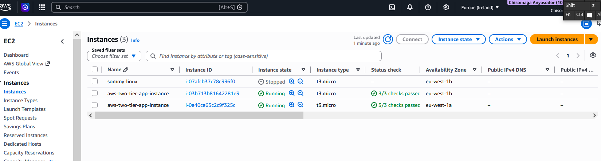

---

## Application Load Balancer

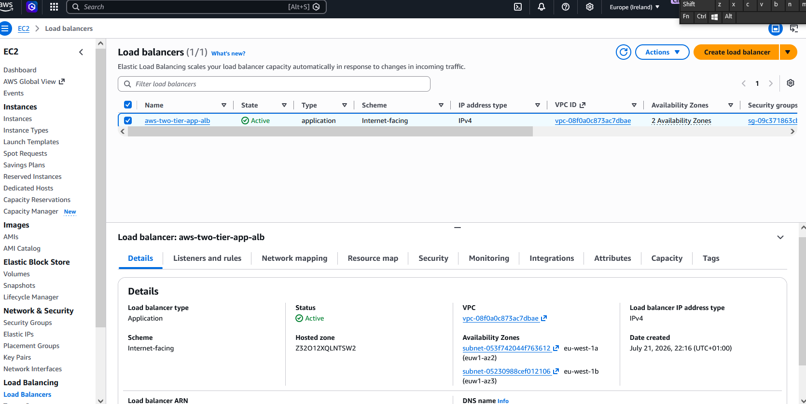

---

## Auto Scaling Group

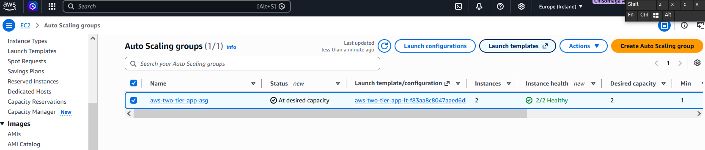

---

## Target Group Health Checks

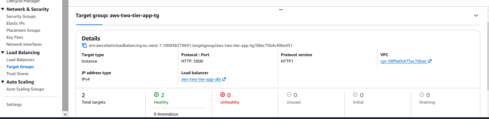

---

## Amazon RDS

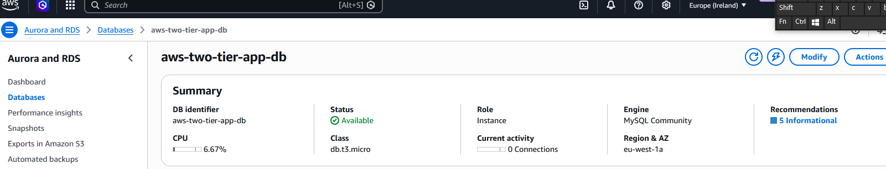

---

## Amazon ECR Repository

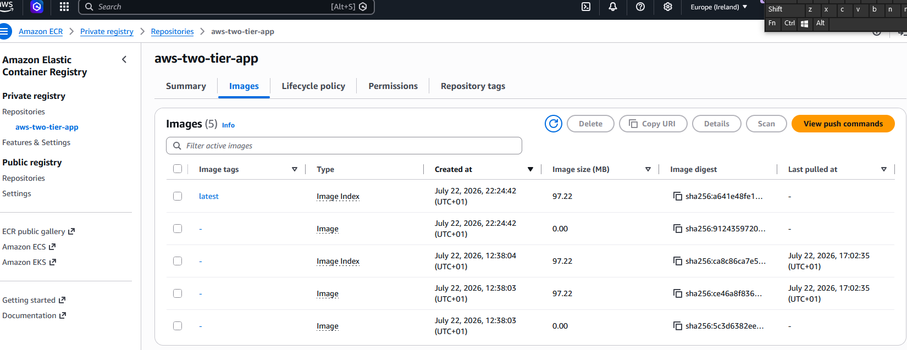

---

## Running Application

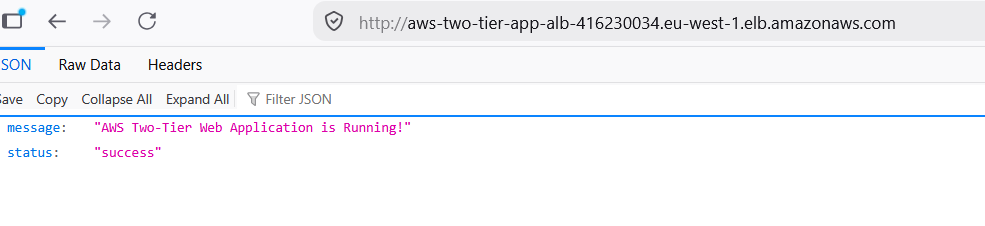

---

## Terraform Deployment

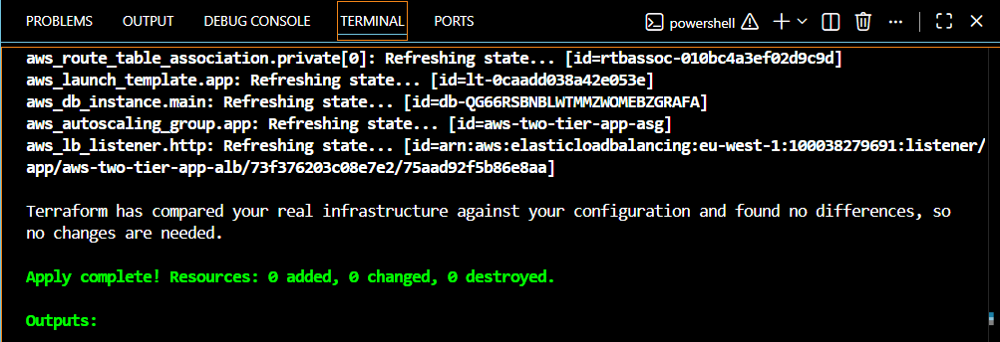


---

# 📈 High Availability Features

This architecture provides:

✅ Multiple availability zones  
✅ Load-balanced traffic  
✅ Automatic instance replacement  
✅ Private application servers  
✅ Managed database service  
✅ Reproducible infrastructure  

## Monitoring and Observability

The application uses Amazon CloudWatch Agent and CloudWatch Alarms to provide production monitoring and operational visibility.

### CloudWatch Dashboard

Configured metrics:

- CPU utilization
- Memory usage
- Disk utilization

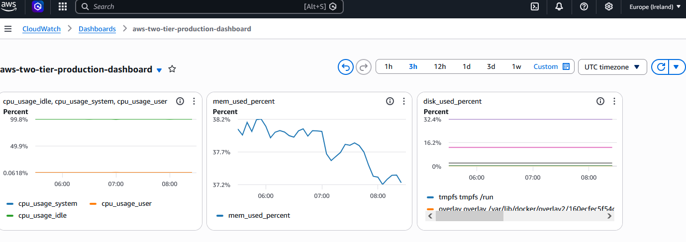


### CloudWatch Alarms

Configured alarms:

### High CPU Alarm
Monitors Auto Scaling Group CPU utilization.

Trigger:
- CPU usage >= 80% for 5 minutes

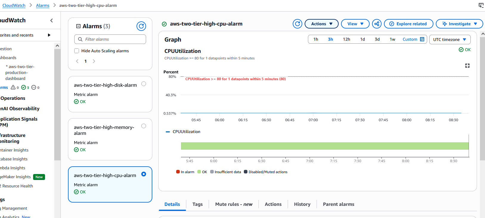

### High Memory Alarm
Monitors EC2 memory consumption using CloudWatch Agent.

Trigger:
- Memory usage >= 85% for 5 minutes

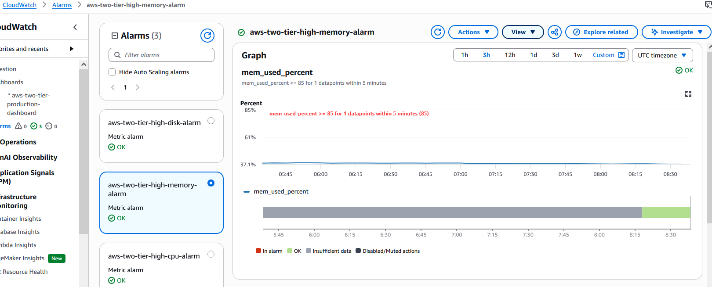

### High Disk Alarm
Monitors EC2 disk utilization.

Trigger:
- Disk usage >= 80% for 5 minutes

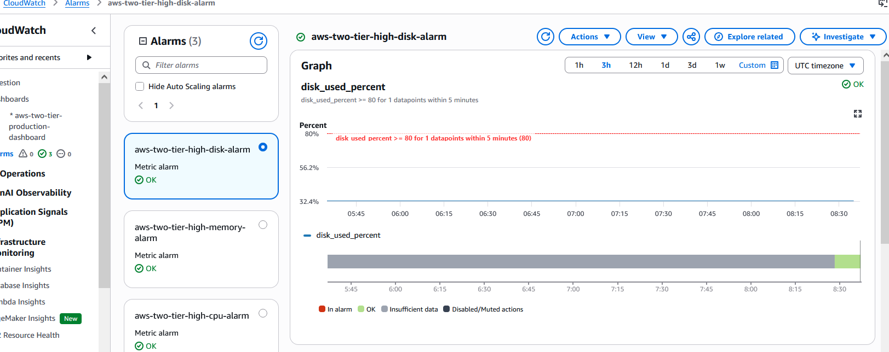

### SNS Notifications

CloudWatch alarms publish notifications through Amazon SNS.

Alert flow:

CloudWatch Alarm  
⬇️  
SNS Topic  
⬇️  
Email Notification

---

# 🧠 Skills Demonstrated

This project demonstrates practical experience with:

## Cloud Engineering

- AWS architecture design
- VPC networking
- EC2 deployment
- RDS management
- Load balancing


## DevOps

- Infrastructure as Code
- Docker deployment
- Linux administration
- Automation scripting


## Networking

- Public/private subnet design
- Routing
- Security Groups
- NAT Gateway


## Security

- IAM roles
- Least privilege access
- Secure database connectivity


---

# 🔮 Future Improvements

Planned enhancements:

## CI/CD Pipeline

Implement:

- GitHub Actions
- Automated Docker builds
- Automated deployments


## Monitoring

Add:

- CloudWatch dashboards
- EC2 alarms
- ALB monitoring
- SNS notifications


## Advanced Deployment Strategies

Future upgrades:

- Blue/Green deployments
- Kubernetes (Amazon EKS)
- AWS WAF integration
- Multi-region deployment


---

# ⭐ Project Status

✅ Infrastructure deployed successfully  
✅ Docker application running  
✅ ALB configured  
✅ Auto Scaling working  
✅ EC2 health checks passing  
✅ RDS connected  
✅ Terraform deployment completed  

Next phase: CI/CD pipeline and CloudWatch monitoring.


# 👩🏽‍💻 Author

**Chisomaga Anyasodor**

Cloud Engineering | AWS | DevOps

LinkedIn:
https://www.linkedin.com/in/chisomaga-a-685ba1408

---
